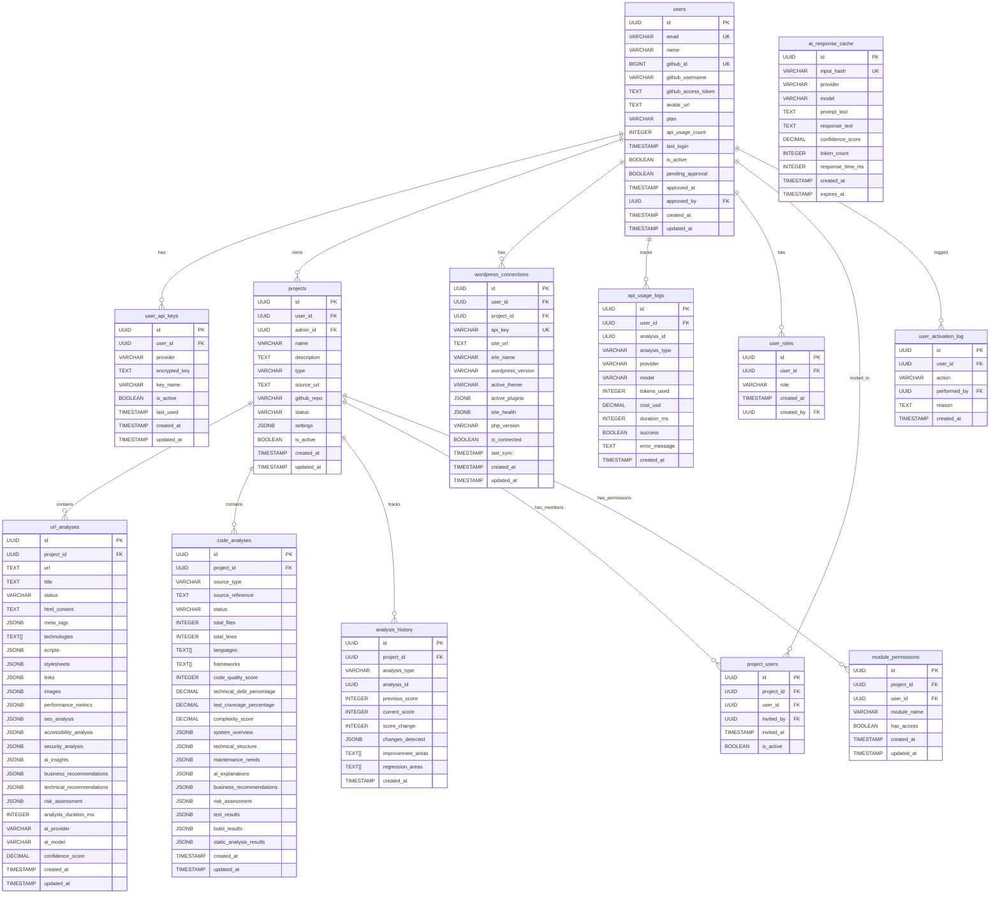
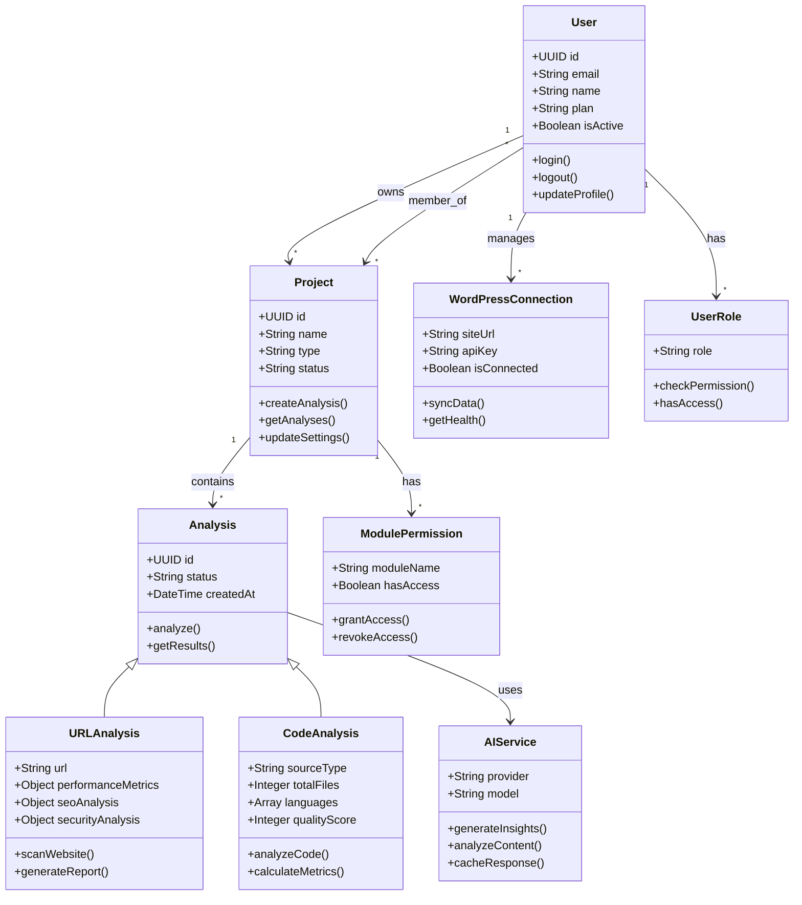
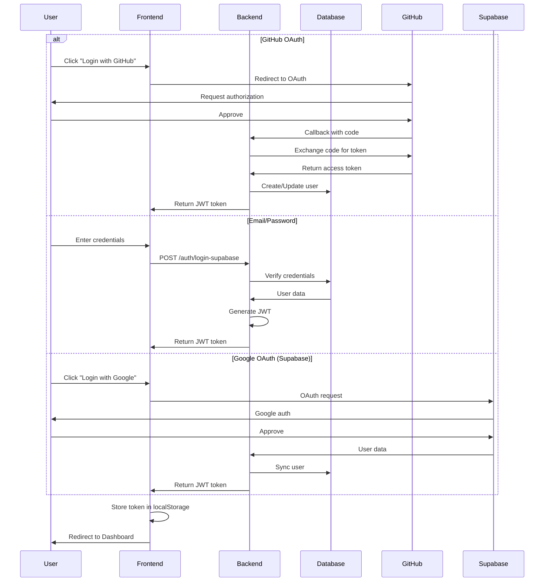
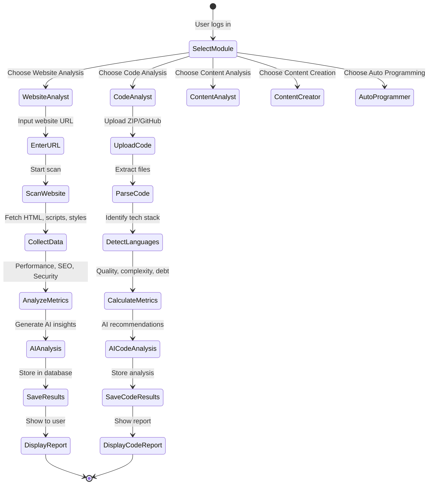
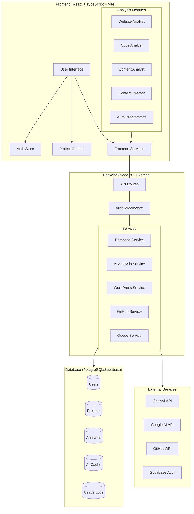
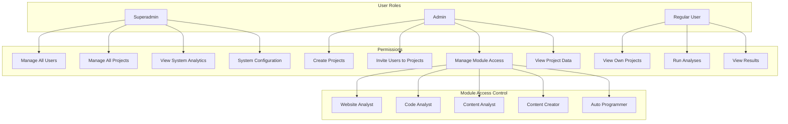
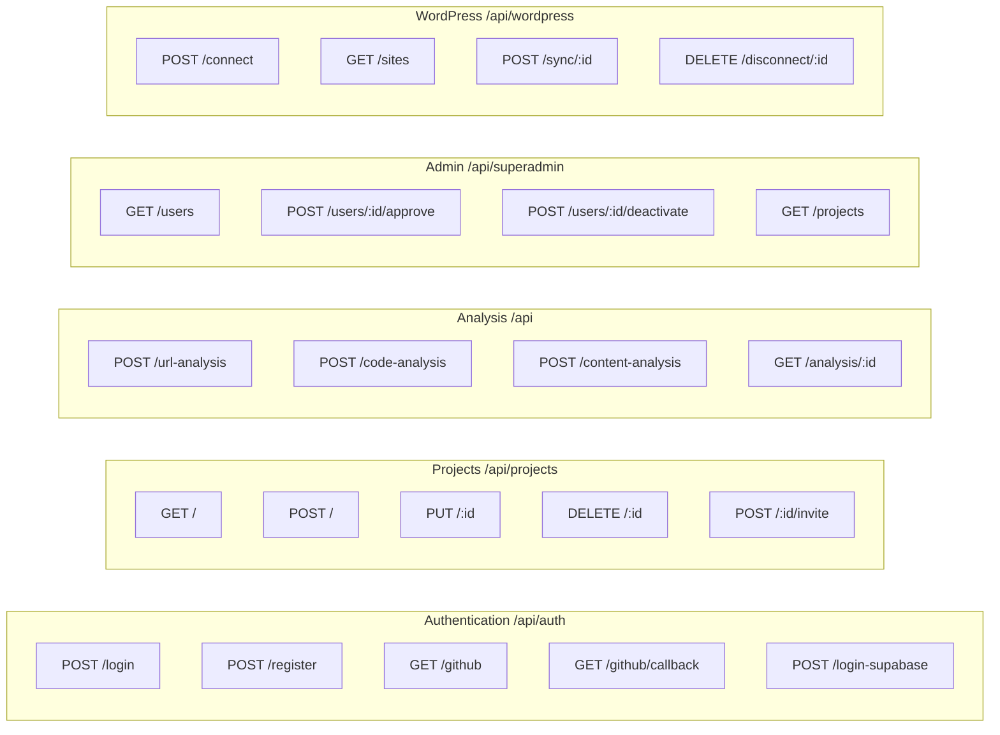

# CodeAnalyst System Documentation

Comprehensive system architecture, database schema, and UML documentation

## Table of Contents

1. [Database Schema Diagram](#database-schema-diagram)
2. [System Overview Class Diagram](#system-overview-class-diagram)
3. [Authentication Flow](#authentication-flow)
4. [Analysis Workflow](#analysis-workflow)
5. [Module Architecture](#module-architecture)
6. [User Role & Permission System](#user-role--permission-system)
7. [API Endpoint Structure](#api-endpoint-structure)
8. [Key System Features](#key-system-features)
9. [Security Features](#security-features)
10. [Deployment Architecture](#deployment-architecture)

---

## 1. Database Schema Diagram

---

## 2. System Overview Class Diagram

---

## 3. Authentication Flow

---

## 4. Analysis Workflow

---

## 5. Module Architecture

---

## 6. User Role & Permission System

---

## 7. API Endpoint Structure

---

## 8. Key System Features

### Authentication System
- **GitHub OAuth**: Custom implementation for GitHub authentication
- **Email/Password**: Supabase Auth integration with bcrypt hashing
- **Google OAuth**: Supabase Auth (ready for implementation)
- **JWT Tokens**: 30-day expiration, stored in localStorage
- **Session Management**: Persistent across page reloads

### User Management
- **Role-Based Access Control (RBAC)**: Superadmin, Admin, User roles
- **User Approval System**: New users require approval before activation
- **Module Permissions**: Granular access control per module per project
- **Activation Logging**: Audit trail for user activation/deactivation

### Project Management
- **Multi-User Projects**: Admins can invite users to projects
- **Project Types**: GitHub, ZIP upload, URL, WordPress
- **Module Access**: Control which modules users can access per project
- **Project Settings**: Customizable JSONB settings per project

### Analysis Modules
1. **Website Analyst**: URL scanning, SEO, performance, security analysis
2. **Code Analyst**: Code quality, complexity, technical debt analysis
3. **Content Analyst**: Content analysis and recommendations
4. **Content Creator**: AI-powered content generation
5. **Auto Programmer**: Automated code generation

### AI Integration
- **Multi-Provider Support**: OpenAI, Google AI, Anthropic
- **Response Caching**: 24-hour cache to reduce API costs
- **Usage Tracking**: Token usage and cost tracking per user
- **Encrypted API Keys**: User-provided API keys stored with AES encryption

### WordPress Integration
- **Site Connection**: Connect WordPress sites via API key
- **Health Monitoring**: Track site health, plugins, themes
- **Data Sync**: Synchronize WordPress data for analysis

---

## 9. Security Features

- **Password Hashing**: bcrypt with salt
- **JWT Authentication**: Secure token-based auth
- **Row Level Security (RLS)**: PostgreSQL RLS policies
- **API Key Encryption**: AES encryption for stored API keys
- **SQL Injection Protection**: Parameterized queries
- **Rate Limiting**: API rate limiting middleware
- **CORS Protection**: Configured CORS policies

---

## 10. Deployment Architecture

| Component | Platform | Technology | Auto-Deploy |
|-----------|----------|------------|-------------|
| Frontend | Vercel | React + TypeScript + Vite | Yes (main branch) |
| Backend | Railway | Node.js + Express | Yes (main branch) |
| Database | Supabase | PostgreSQL | N/A |

### Database Indexes

Performance-optimized indexes on:
- `users(is_active, pending_approval)`
- `projects(user_id, admin_id, is_active)`
- `url_analyses(project_id)`
- `code_analyses(project_id)`
- `ai_response_cache(input_hash)`
- `api_usage_logs(user_id, created_at)`
- `wordpress_connections(user_id, api_key)`

---

**Generated**: 2024
**CodeAnalyst System Documentation v1.0**
