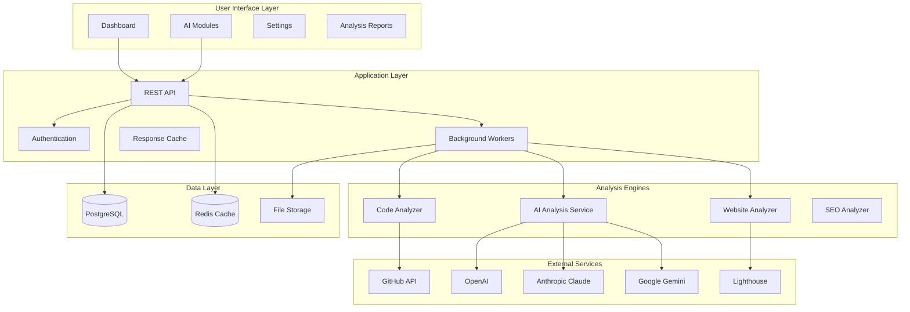
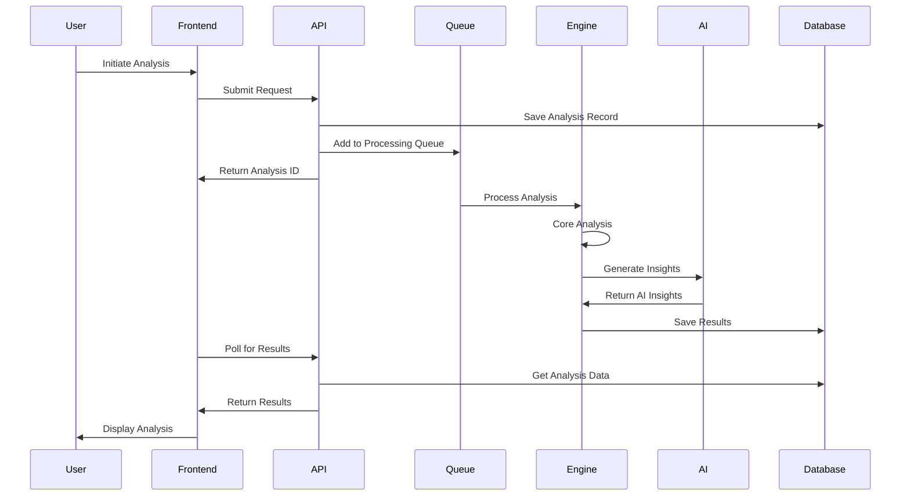
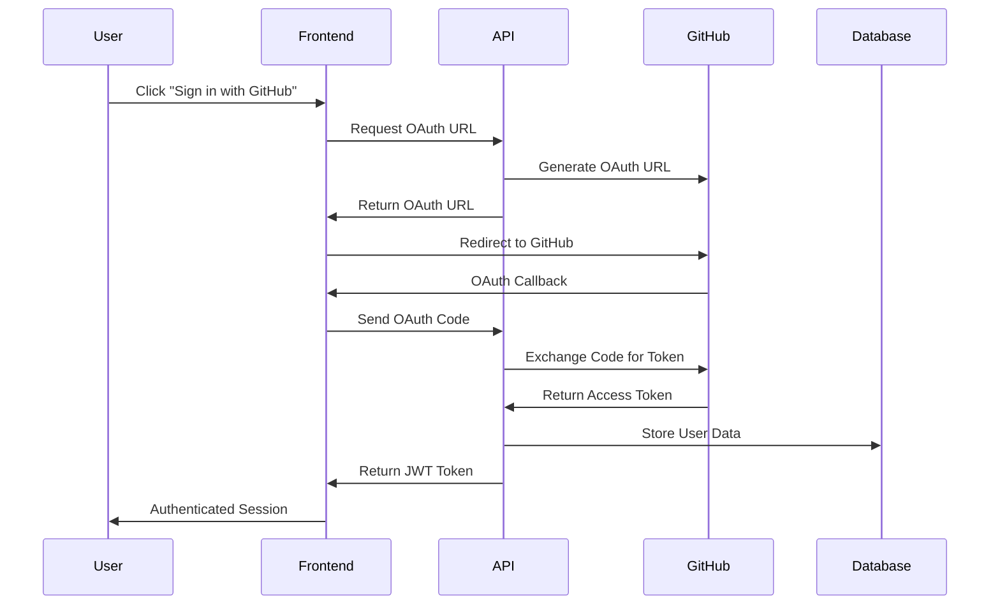

# 🎯 System Overview

CodeAnalyst is a comprehensive AI-powered analysis platform that provides intelligent insights for websites, code repositories, and content optimization.

## 🏗️ High-Level Architecture

### System Components

## 🎯 Core Modules

### 1. Website Analyst
**Purpose**: Comprehensive website analysis and optimization recommendations

**What it analyzes**:
- ⚡ Performance metrics (Core Web Vitals, load times)
- 🔍 SEO optimization (meta tags, content structure)
- ♿ Accessibility compliance (WCAG guidelines)
- 🔒 Security headers and vulnerabilities
- 🛠️ Technology stack detection

**Key Features**:
- Real-time Lighthouse analysis
- AI-powered improvement recommendations
- Security vulnerability scanning
- Multi-device performance testing
- Competitive analysis insights

### 2. Code Analyst
**Purpose**: GitHub repository analysis for code quality and architecture

**What it analyzes**:
- 🏗️ Code architecture and design patterns
- 📊 Quality metrics and complexity scores
- 🧪 Test coverage and testing strategies
- 🔐 Security vulnerabilities and dependencies
- 📝 Documentation completeness

**Key Features**:
- GitHub OAuth integration
- API-based repository analysis (no cloning)
- Multi-language support
- AI code review and recommendations
- Technical debt assessment

### 3. Content Analyst
**Purpose**: Content quality and SEO optimization analysis

**What it analyzes**:
- 📖 Readability and content structure
- 🎯 SEO keyword optimization
- 🎭 Tone and sentiment analysis
- 📊 Engagement potential metrics
- 🔍 Content uniqueness verification

**Key Features**:
- Multi-format content support
- Brand voice consistency analysis
- Competitive content analysis
- Social media optimization
- Content performance predictions

### 4. Auto Programmer
**Purpose**: AI-powered code generation and programming assistance

**What it generates**:
- 💻 Functions, classes, and components
- 📚 Documentation and comments
- 🧪 Unit and integration tests
- ⚙️ Configuration files and scripts
- 🎨 Project templates and boilerplate

**Key Features**:
- Multi-language code generation
- Framework-specific templates
- Best practices enforcement
- Custom coding standards
- Interactive code refinement

### 5. Content Creator
**Purpose**: Marketing content and copy generation with brand consistency

**What it creates**:
- 📝 Marketing copy and advertisements
- 📱 Social media content and campaigns
- 📧 Email templates and sequences
- 📖 Documentation and help articles
- 🎯 SEO-optimized blog content

**Key Features**:
- Brand voice training and consistency
- Multi-format content generation
- A/B testing content variations
- Performance optimization suggestions
- Content calendar planning

## 🔄 Data Flow Architecture

### Request Processing Flow

### Authentication Flow

## 🛠️ Technology Stack

### Frontend Technologies
- **React 18** - Component framework with hooks
- **TypeScript** - Type-safe JavaScript development
- **Vite** - Fast build tool and development server
- **Tailwind CSS** - Utility-first CSS framework
- **Zustand** - Lightweight state management
- **React Query** - Server state management
- **React Router** - Client-side routing

### Backend Technologies
- **Node.js** - JavaScript runtime environment
- **Express.js** - Web application framework
- **PostgreSQL** - Primary relational database
- **Redis** - Caching and session storage
- **JWT** - JSON Web Token authentication
- **Winston** - Structured logging library
- **Puppeteer** - Browser automation for analysis

### AI & Analysis Tools
- **OpenAI GPT-4** - Advanced language model
- **Anthropic Claude** - AI assistant for analysis
- **Google Gemini** - Multimodal AI capabilities
- **Lighthouse** - Web performance analysis
- **Puppeteer** - Browser automation
- **Cheerio** - Server-side HTML parsing

### DevOps & Deployment
- **Vercel** - Frontend hosting and deployment
- **Railway** - Backend hosting and deployment
- **GitHub Actions** - CI/CD automation
- **Docker** - Containerization (optional)
- **ngrok** - Development tunneling

## 📊 Performance & Scalability

### Frontend Performance
- **Code Splitting**: Route-based lazy loading
- **Image Optimization**: Automatic image compression
- **Caching Strategy**: Service worker caching
- **Bundle Size**: Optimized with tree shaking
- **Core Web Vitals**: Optimized for performance metrics

### Backend Performance
- **Connection Pooling**: Database connection optimization
- **Queue System**: Background job processing
- **Response Compression**: Gzip compression
- **Rate Limiting**: API abuse prevention
- **Caching Layers**: Redis-based response caching

### Scalability Considerations
- **Horizontal Scaling**: Stateless API design
- **Load Balancing**: Multiple backend instances
- **Database Optimization**: Indexed queries and pagination
- **CDN Integration**: Static asset distribution
- **Microservices Ready**: Modular service architecture

## 🔒 Security Features

### Authentication & Authorization
- **OAuth 2.0**: GitHub OAuth integration
- **JWT Tokens**: Secure session management
- **Role-Based Access**: User permission levels
- **API Key Management**: Secure AI provider keys
- **Session Security**: Automatic token refresh

### Data Protection
- **Input Validation**: Comprehensive sanitization
- **SQL Injection Prevention**: Parameterized queries
- **XSS Protection**: Content Security Policy
- **CORS Configuration**: Proper origin restrictions
- **Encryption**: Sensitive data encryption

### Privacy Compliance
- **Data Minimization**: Only collect necessary data
- **User Consent**: Clear privacy policies
- **Data Retention**: Configurable retention periods
- **Export Capabilities**: User data portability
- **Deletion Rights**: Complete data removal

## 📈 Monitoring & Analytics

### Application Monitoring
- **Health Checks**: Automated system health monitoring
- **Error Tracking**: Comprehensive error logging
- **Performance Metrics**: Response time monitoring
- **Resource Usage**: CPU, memory, and database monitoring
- **Uptime Monitoring**: Service availability tracking

### User Analytics
- **Usage Patterns**: Feature usage tracking
- **Performance Analytics**: User experience metrics
- **Error Analytics**: Client-side error tracking
- **Conversion Tracking**: Goal completion monitoring
- **A/B Testing**: Feature variation testing

## 🚀 Future Roadmap

### Planned Features
- **Mobile Applications**: iOS and Android apps
- **Team Collaboration**: Shared workspaces and projects
- **API Marketplace**: Third-party integrations
- **Advanced Analytics**: Custom dashboards and reports
- **Enterprise Features**: SSO, audit logs, compliance tools

### Technology Improvements
- **Real-time Collaboration**: WebSocket-based features
- **Machine Learning**: Custom ML models for analysis
- **Edge Computing**: Distributed analysis processing
- **GraphQL API**: More efficient data fetching
- **Progressive Web App**: Enhanced offline capabilities

---

**Next**: [Module Workflows](./workflows.md) | [API Documentation](../api/README.md)
