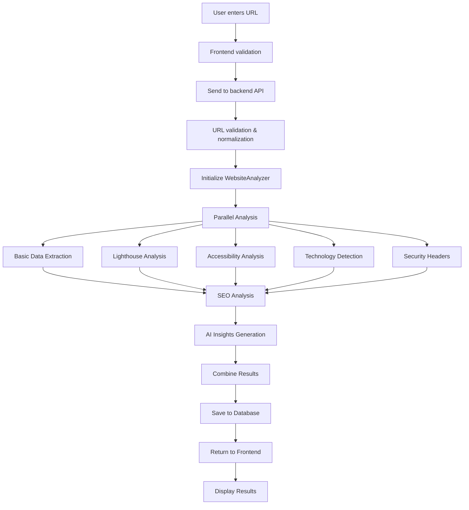
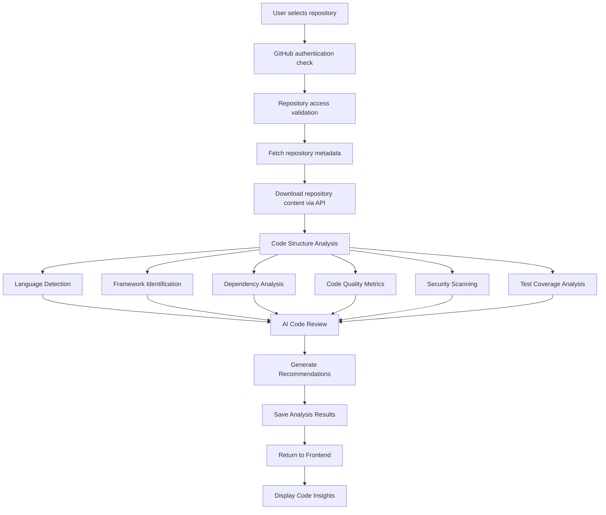
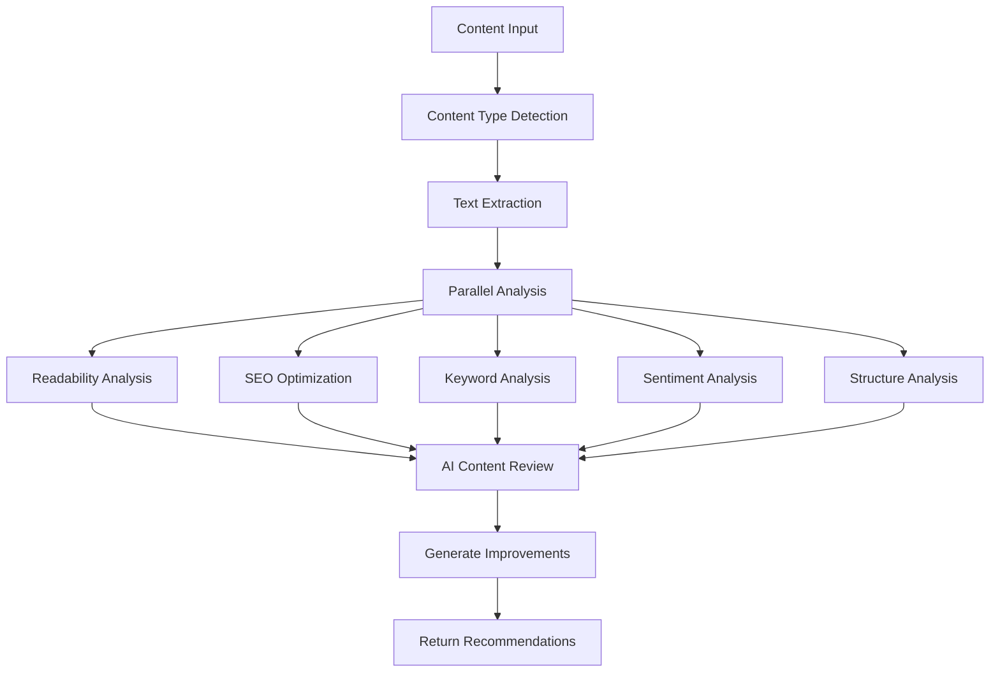
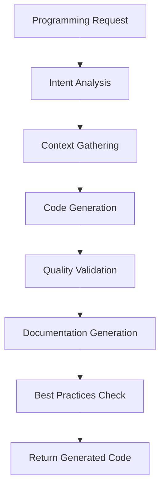
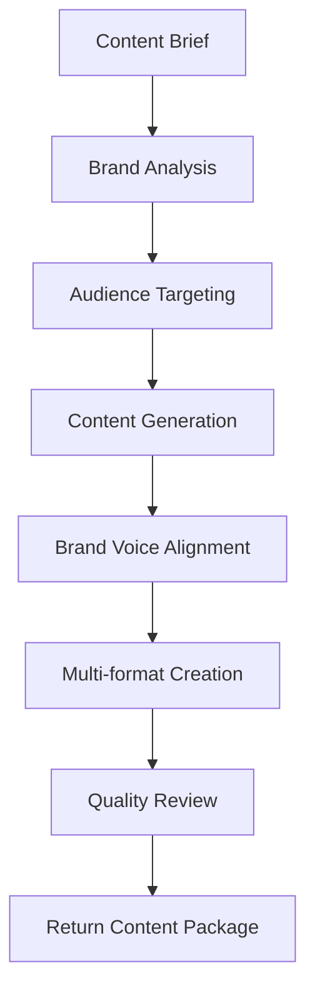

# 🔄 Module Workflows

This document details how each CodeAnalyst module works, including data flow, processing steps, and integration points.

## 🌐 Website Analyst Workflow

### Overview
The Website Analyst module performs comprehensive website analysis including performance, SEO, accessibility, security, and technology detection.

### Workflow Steps



### Processing Details

#### 1. Basic Data Extraction (30% progress)
```javascript
// What it checks:
- HTML content extraction
- Meta tags and headers
- Page title and description
- Response headers
- Load time and status codes
- Robots.txt and sitemap detection
```

#### 2. Lighthouse Analysis (40% progress)
```javascript
// Performance metrics:
- First Contentful Paint (FCP)
- Largest Contentful Paint (LCP)
- Cumulative Layout Shift (CLS)
- First Input Delay (FID)
- Time to Interactive (TTI)
- Speed Index
```

#### 3. Technology Detection (50% progress)
```javascript
// Technologies identified:
- Frontend frameworks (React, Vue, Angular)
- Backend technologies (Node.js, PHP, Python)
- Content Management Systems
- Analytics tools
- CDN services
- JavaScript libraries
```

#### 4. SEO Analysis (60% progress)
```javascript
// SEO factors checked:
- Meta title and description optimization
- Header structure (H1-H6)
- Internal/external link analysis
- Image alt text compliance
- Schema markup detection
- Open Graph tags
- Social media optimization
```

#### 5. Security Analysis (70% progress)
```javascript
// Security headers checked:
- Content Security Policy (CSP)
- HTTP Strict Transport Security (HSTS)
- X-Frame-Options
- X-Content-Type-Options
- Referrer Policy
- SSL/TLS configuration
```

#### 6. AI Insights Generation (90% progress)
```javascript
// AI analysis includes:
- Performance improvement recommendations
- SEO optimization suggestions
- Security enhancement advice
- User experience improvements
- Technical debt identification
- Competitive analysis insights
```

### Output Format
```json
{
  "url": "https://example.com",
  "scores": {
    "overall": 85,
    "performance": 90,
    "seo": 80,
    "accessibility": 85,
    "security": 88,
    "bestPractices": 92
  },
  "metrics": {
    "loadTime": 1.2,
    "fcp": 0.8,
    "lcp": 1.5,
    "cls": 0.05
  },
  "technologies": ["React", "Webpack", "Cloudflare"],
  "seo": {
    "title": "Optimized",
    "description": "Good",
    "headings": "Well structured"
  },
  "aiInsights": {
    "summary": "...",
    "recommendations": [...],
    "priorities": [...]
  }
}
```

## 📂 Code Analyst Workflow

### Overview
The Code Analyst module analyzes GitHub repositories for code quality, architecture, security, and best practices.

### Workflow Steps



### Processing Details

#### 1. Repository Access (10% progress)
```javascript
// Access validation:
- Public repository: Direct API access
- Private repository: User's GitHub token required
- Repository size check (max 500MB)
- Branch validation (default or specified)
```

#### 2. Content Fetching (30% progress)
```javascript
// Content extraction:
- File tree structure
- Source code files
- Configuration files
- Documentation files
- Package/dependency files
- Ignore hidden/binary files
```

#### 3. Code Analysis (50% progress)
```javascript
// Analysis components:
- Lines of code count
- Programming languages distribution
- Framework and library detection
- Code complexity calculation
- Cyclomatic complexity metrics
- Code duplication detection
```

#### 4. Quality Assessment (70% progress)
```javascript
// Quality metrics:
- Code organization score
- Naming conventions compliance
- Documentation coverage
- Test file presence
- Error handling patterns
- Security best practices
```

#### 5. AI Code Review (90% progress)
```javascript
// AI analysis includes:
- Architecture recommendations
- Code improvement suggestions
- Security vulnerability identification
- Performance optimization tips
- Best practices compliance
- Refactoring opportunities
```

### Output Format
```json
{
  "repository": "owner/repo",
  "analysis": {
    "totalFiles": 245,
    "totalLines": 15420,
    "languages": {
      "TypeScript": 65.2,
      "JavaScript": 28.4,
      "CSS": 6.4
    },
    "frameworks": ["React", "Express.js", "Tailwind CSS"],
    "qualityScore": 8.5,
    "complexity": "Medium",
    "testCoverage": 78.5
  },
  "security": {
    "vulnerabilities": 2,
    "severity": "Low",
    "recommendations": [...]
  },
  "aiInsights": {
    "architectureScore": 9.2,
    "recommendations": [...],
    "refactoringOpportunities": [...]
  }
}
```

## 📝 Content Analyst Workflow

### Overview
Analyzes content for quality, SEO optimization, readability, and engagement potential.

### Workflow Steps



### Analysis Components

#### Content Quality Metrics
- Readability scores (Flesch-Kincaid, Gunning Fog)
- Sentence structure analysis
- Vocabulary complexity
- Content length optimization
- Paragraph structure evaluation

#### SEO Optimization
- Keyword density analysis
- Meta description optimization
- Header structure validation
- Internal linking opportunities
- Content uniqueness verification

#### Engagement Analysis
- Tone and sentiment analysis
- Call-to-action identification
- Social sharing potential
- User engagement predictors
- Content performance indicators

## 🤖 Auto Programmer Workflow

### Overview
AI-powered code generation, documentation creation, and programming assistance.

### Workflow Steps



### Generation Components

#### Code Generation
- Function and class creation
- API endpoint generation
- Database schema creation
- Test case generation
- Configuration file creation

#### Documentation Generation
- README file creation
- API documentation
- Code comments and docstrings
- Usage examples
- Installation guides

#### Quality Assurance
- Code style compliance
- Security best practices
- Performance optimization
- Error handling implementation
- Testing strategy recommendations

## ✍️ Content Creator Workflow

### Overview
Creates marketing content, documentation, and copy with brand consistency.

### Workflow Steps



### Creation Components

#### Content Types
- Blog posts and articles
- Social media content
- Marketing copy
- Email campaigns
- Product descriptions
- Technical documentation

#### Brand Consistency
- Tone and voice analysis
- Style guide compliance
- Messaging alignment
- Visual content recommendations
- Brand value integration

#### Multi-format Output
- Web-optimized content
- Social media formats
- Email templates
- Print-ready materials
- Video script generation

## 🔄 Common Workflow Patterns

### Error Handling
```javascript
// All modules implement:
1. Input validation
2. Graceful degradation
3. Fallback mechanisms
4. Comprehensive error logging
5. User-friendly error messages
```

### Progress Tracking
```javascript
// Progress updates at key stages:
- 10%: Initial validation
- 30%: Data extraction
- 50%: Core analysis
- 70%: Secondary analysis
- 90%: AI processing
- 100%: Results compilation
```

### Caching Strategy
```javascript
// Caching implemented for:
- AI responses (content-based)
- API responses (time-based)
- Analysis results (user-based)
- Static assets (version-based)
```

---

**Next**: [API Documentation](../api/README.md) | [Frontend Components](../frontend/README.md)
