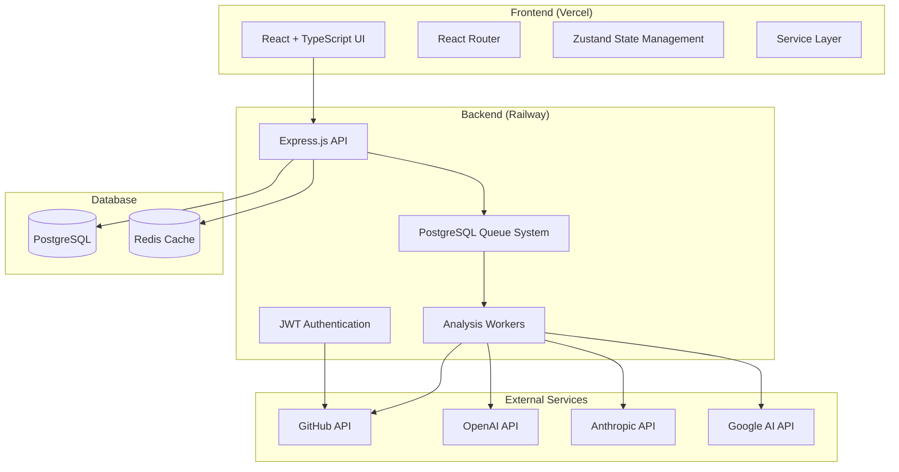
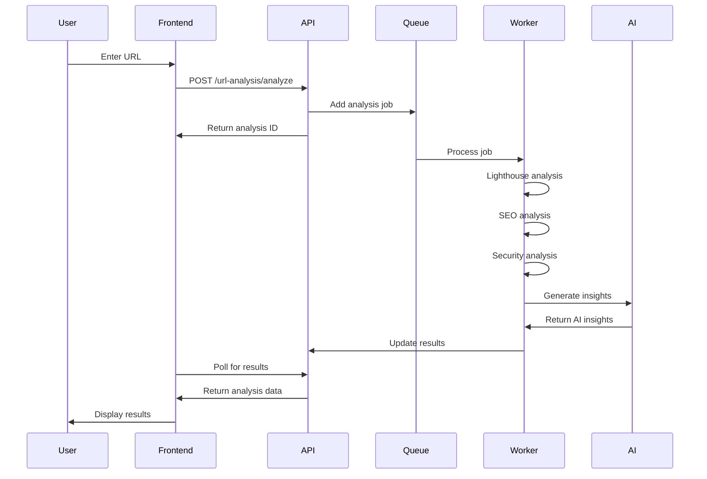
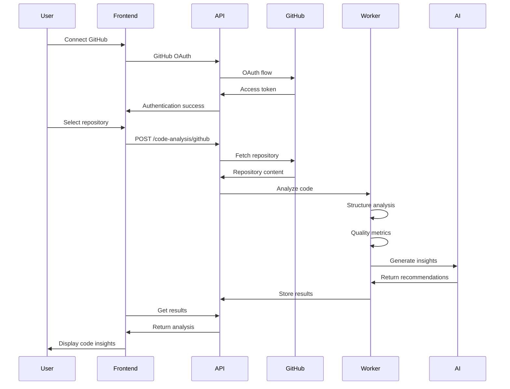

# 🏗️ System Architecture

CodeAnalyst is a comprehensive AI-powered website and code analysis platform built with modern web technologies.

## 📐 High-Level Architecture



## 🎯 Core Modules

### 1. **Website Analyst Module**
- **Purpose**: Analyze any website for performance, SEO, accessibility, and security
- **Components**: WebsiteAnalyzer, SEOAnalyzer, Lighthouse integration
- **AI Integration**: Generates intelligent insights and recommendations

### 2. **Code Analyst Module**
- **Purpose**: Analyze GitHub repositories for code quality, structure, and best practices
- **Components**: CodeAnalyzer, GitHubService, dependency analysis
- **AI Integration**: Code review, architecture recommendations, security analysis

### 3. **Content Analyst Module**
- **Purpose**: Analyze content for quality, SEO optimization, and engagement
- **Components**: Content extraction, readability analysis, keyword optimization
- **AI Integration**: Content improvement suggestions, tone analysis

### 4. **Auto Programmer Module**
- **Purpose**: Generate code, documentation, and implementation suggestions
- **Components**: Code generation, template creation, boilerplate generation
- **AI Integration**: Full AI-powered programming assistance

### 5. **Content Creator Module**
- **Purpose**: Create marketing content, documentation, and copy
- **Components**: Content templates, brand voice analysis, multi-format output
- **AI Integration**: Creative content generation with brand consistency

## 🔄 Data Flow

### Website Analysis Flow


### GitHub Code Analysis Flow


## 🧩 Component Architecture

### Frontend Components
```
src/
├── components/           # Reusable UI components
│   ├── Layout.tsx       # Main app layout
│   ├── Header.tsx       # Navigation header
│   ├── Sidebar.tsx      # Navigation sidebar
│   ├── ProtectedRoute.tsx # Authentication guard
│   └── reports/         # Analysis result components
├── pages/               # Page components
│   ├── modules/         # AI module pages
│   ├── Dashboard.tsx    # Main dashboard
│   └── Settings.tsx     # User settings
├── services/            # API communication
├── stores/              # State management
└── utils/               # Helper functions
```

### Backend Services
```
backend/src/
├── routes/              # API route handlers
│   ├── auth.js         # Authentication routes
│   ├── urlAnalysis.js  # Website analysis
│   └── codeAnalysis.js # Code analysis
├── services/            # Business logic
│   ├── WebsiteAnalyzer.js # Website analysis engine
│   ├── CodeAnalyzer.js    # Code analysis engine
│   ├── AIAnalysisService.js # AI integration
│   └── GitHubService.js   # GitHub API wrapper
├── middleware/          # Express middleware
└── workers/             # Background job processors
```

## 🔌 Integration Points

### AI Provider Integration
- **Multiple Providers**: OpenAI, Anthropic Claude, Google Gemini
- **Fallback System**: Automatic fallback to available providers
- **Caching**: AI response caching for consistency and cost optimization
- **Rate Limiting**: Built-in rate limiting for API calls

### GitHub Integration
- **OAuth Authentication**: Secure GitHub OAuth flow
- **Repository Access**: Both public and private repository support
- **API-based Analysis**: No local cloning, uses GitHub API for content
- **Branch Support**: Analyze specific branches or default branch

### Database Integration
- **PostgreSQL**: Primary database for user data and analysis results
- **Redis**: Caching layer and session storage
- **Queue System**: PostgreSQL-based job queue for scalability

## 📊 Performance Considerations

### Frontend Optimization
- **Code Splitting**: Route-based code splitting with React.lazy
- **State Management**: Efficient state updates with Zustand
- **Caching**: Service worker caching for offline functionality
- **Bundle Size**: Optimized builds with Vite

### Backend Optimization
- **Connection Pooling**: PostgreSQL connection pooling
- **Async Processing**: Background job processing for heavy tasks
- **Response Compression**: Gzip compression for API responses
- **Error Handling**: Comprehensive error handling and logging

## 🔒 Security Features

### Authentication & Authorization
- **JWT Tokens**: Secure JWT-based authentication
- **GitHub OAuth**: Secure third-party authentication
- **Token Expiration**: Automatic token refresh and expiration
- **Route Protection**: Protected routes and API endpoints

### Data Security
- **Input Validation**: Comprehensive input validation and sanitization
- **SQL Injection Prevention**: Parameterized queries
- **XSS Protection**: Content Security Policy headers
- **CORS Configuration**: Proper CORS setup for API security

## 📈 Monitoring & Logging

### Application Monitoring
- **Winston Logging**: Structured logging with Winston
- **Error Tracking**: Comprehensive error logging and tracking
- **Performance Metrics**: Response time and throughput monitoring
- **Health Checks**: Automated health check endpoints

### User Analytics
- **Usage Tracking**: Feature usage and user behavior tracking
- **Performance Analytics**: Frontend performance monitoring
- **Error Analytics**: Client-side error tracking and reporting

---

**Next**: [Module Workflows](./workflows.md) | [API Documentation](../api/README.md)
